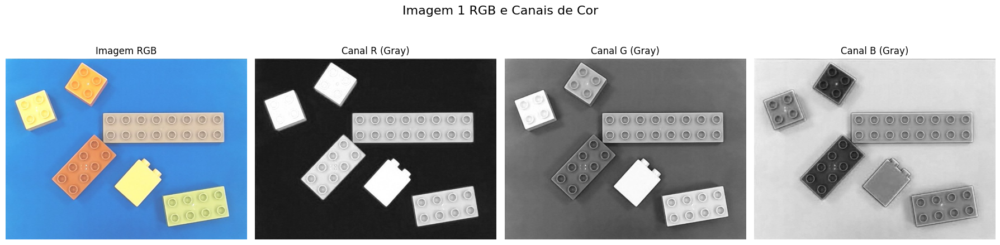
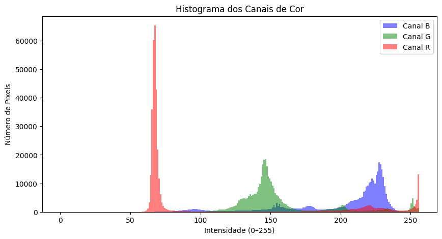
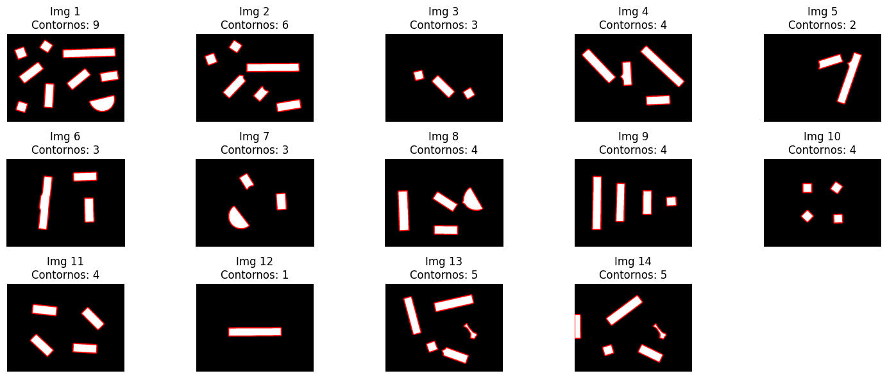
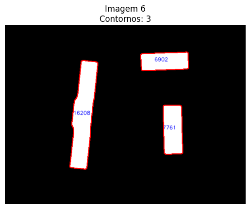
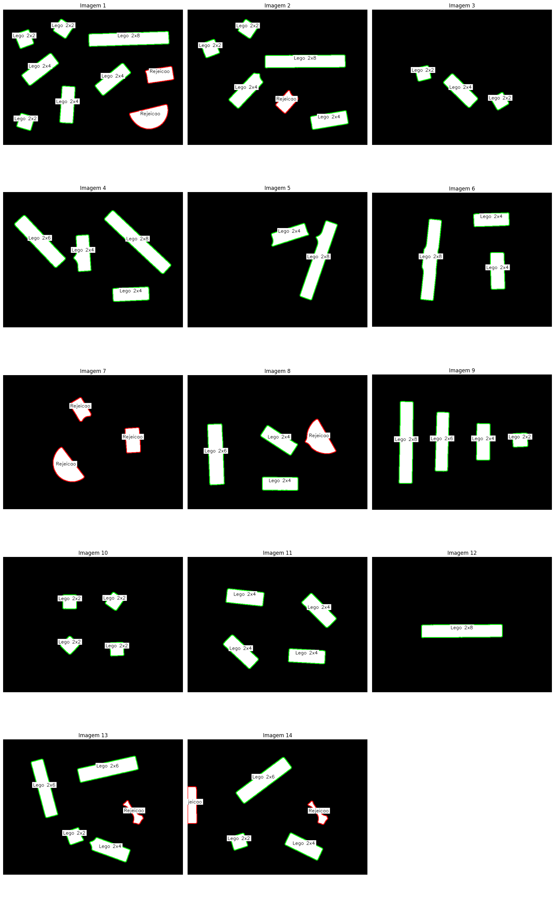

# 🧱 PIV – LEGO Piece Detection & Classification

> Practical assignment for the course **Processamento de Imagem e Visão (PIV)**  
> BSc in Computer Engineering and Multimedia – **ISEL**  
> Winter semester **2025 / 2026**

---

## 👥 Authors

- **Name:** Miguel Cordeiro — nº 49765 — LEIM51N  
- **Name:** Bruno Santos — nº 45096 — LEIM51N  
- **Instructor:** Eng. Nuno Silva  

---

## 📝 Project Overview

This project implements a complete image-processing pipeline in Python to **detect, segment and classify LEGO bricks** from RGB images.

Starting from raw images of LEGO pieces on a table, the system:

1. Analyses the input images (colour channels, histograms, dataset exploration)  
2. Applies **binarization** to separate pieces from the background  
3. Uses **morphological operations** to clean and refine the binary mask  
4. Extracts **connected components** (one component ≈ one LEGO brick)  
5. Computes **features** (mainly area) for each component  
6. Classifies each object into one of several **LEGO classes** (2x2, 2x4, 2x6, 2x8) plus a **rejection class**

---

## 🧪 Development

This project is organised into six main stages, from raw image analysis to final LEGO brick classification:

1. Analyses the input images (colour channels, histograms, dataset exploration)  
2. Applies binarization to separate pieces from the background  
3. Uses morphological operations to clean and refine the binary mask  
4. Extracts connected components (one component ≈ one LEGO brick)  
5. Computes features (mainly area) for each component  
6. Classifies each object into one of several LEGO classes (2x2, 2x4, 2x6, 2x8) plus a rejection class  

Below is a brief summary of each phase with example results.

---

### 1️⃣ Image Analysis

In the first phase we explore the input images:

- Load the LEGO dataset (multiple images with different layouts).  
- Inspect RGB channels separately to identify the most discriminative one for segmentation.  
- Analyse histograms and intensity distributions to understand foreground/background separation.  

<p align="center">
  
</p>

> Original image + three small panels showing the R, G and B channels.

<p align="center">
  
</p>

> RGB channels histograms.

---

### 2️⃣ Binarization

Next, we convert the selected channel into a **binary mask** that separates LEGO pieces from the background:

- Apply smoothing (e.g. Gaussian blur) to reduce noise.  
- Threshold the image (global or adaptive threshold) to obtain a clean foreground.  
- Choose parameters that best preserve LEGO shapes while removing background.  

<p align="center">
  
</p>

> Binary image with threshold applied.

---

### 3️⃣ Morphological Improvement

The raw binary image is then refined using **morphological operations**:

- Remove small isolated artefacts (noise).  
- Fill small holes inside LEGO bricks.  
- Smooth boundaries so that each LEGO piece becomes a solid, well-defined region.  

<p align="center">
  
</p>

> Comparison before vs after morphology (erosion/dilation, opening/closing).

---

### 4️⃣ Connected Components Extraction

With a clean binary mask, we identify each individual LEGO piece:

- Run connected components / contour detection on the binary image.  
- Each connected region corresponds to one candidate LEGO brick.  
- Optionally overlay contours on the binary image.

<p align="center">
  
</p>

> Binary image with coloured contours.

---

### 5️⃣ Feature Extraction

For every connected component, we compute **features** used for classification:

- Main feature: **area** (in pixels) obtained from each contour.  
- Store all areas in arrays for later analysis.  
- Visualise feature distributions (e.g. plots per class / per image) to design the classifier thresholds.  

<p align="center">
  
</p>

> Plot of component areas for LEGO pieces.

---

### 6️⃣ Object Classification

Finally, each component is mapped to a **LEGO class**:

- Use area intervals to define classes:  
  - `Lego 2x2`, `Lego 2x4`, `Lego 2x6`, `Lego 2x8`  
  - `Rejection` for objects outside all valid intervals  
- Apply the classifier to all components in each image.  
- Draw bounding boxes and text labels directly onto the original image.  

<p align="center">
  
</p>

> 💡 Binary image with bounding boxes and class labels on top of each LEGO brick.

---


All development and reporting are contained in the Jupyter Notebook:

```text
src/P1_51N_A49765_45096.ipynb
